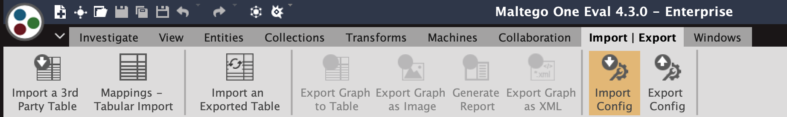
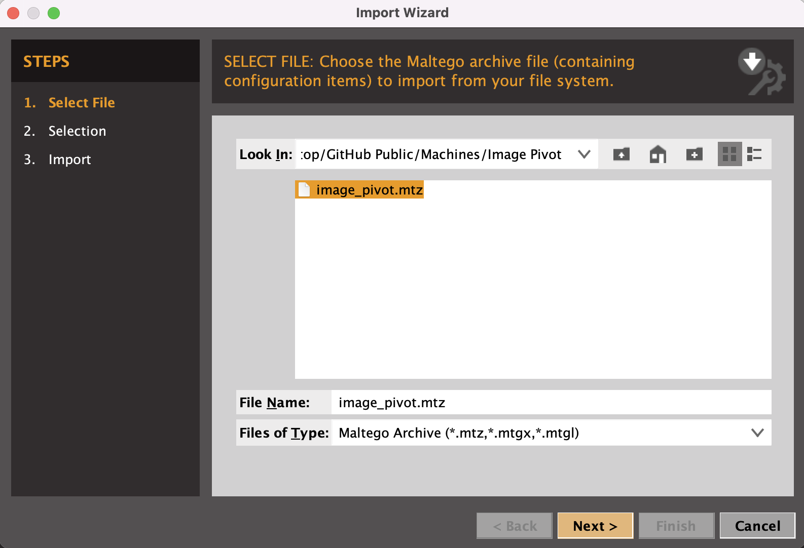
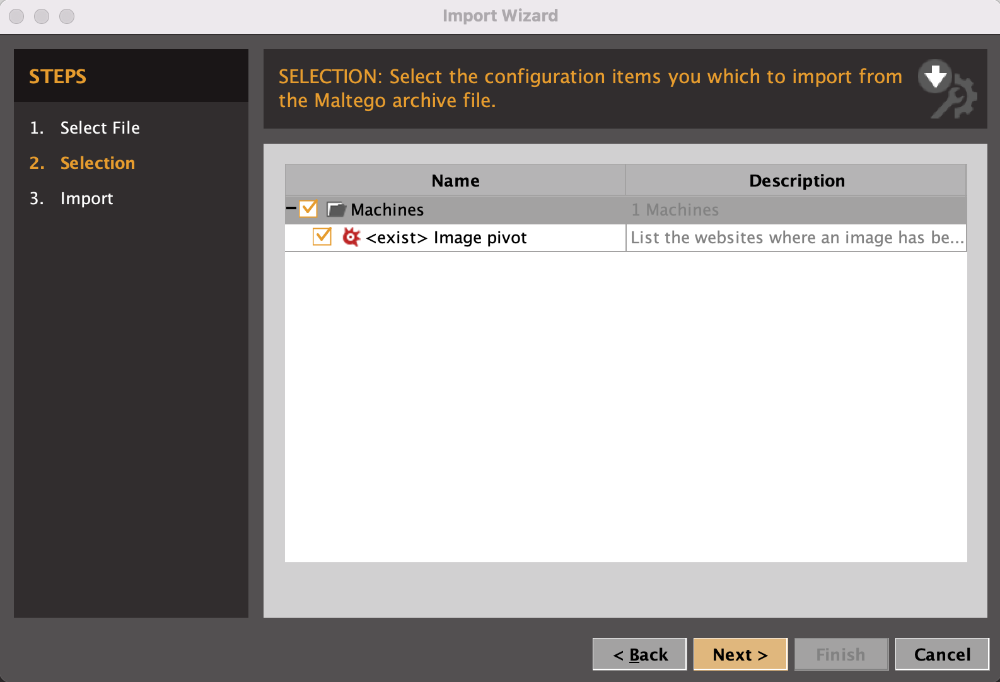
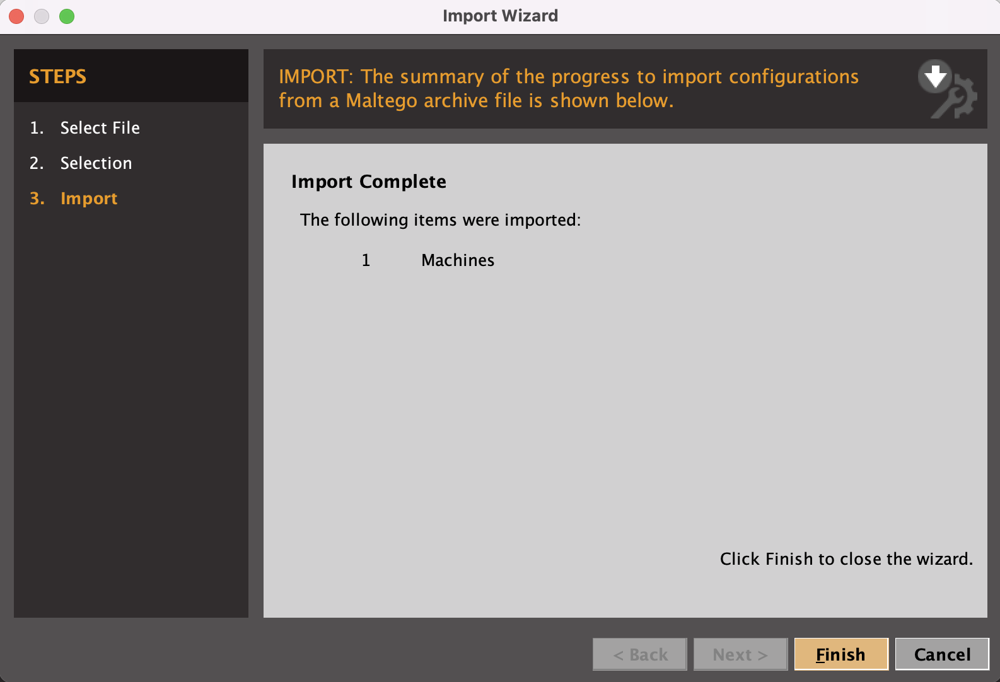

# MaltegoMachines
A repo where I stack my Maltego machines

## How to add a machine to Maltego?
### Step 1
Download the `.mtz` file that contains the machine

### Step 2
In the **Import | Export** tab, click on **Import Config**
`

### Step 3
This will bring up the **Import Wizard**, select the file you downloaded in step 1.

### Step 4
Select what you wish to import from that `.mtz` file. The file in this repo will only contains machines, but Maltego Config Files can contain much more. Click **Next**.

### Step 5
Maltego will present you a summary of what was imported. If everything went well, you should have 1 machine imported.

